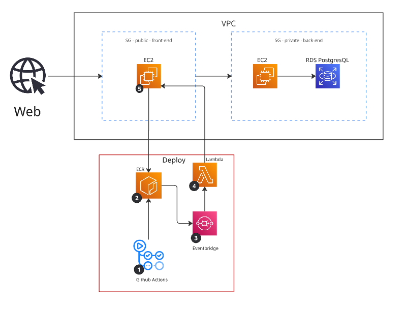

# About this project

> Registration and login system with `JWT` for session management, built in **Golang**.

---


## Process visualization



## Cloud - `AWS`

> The system was deployed on AWS, using a fully automated setup to handle deployment and environment orchestration.

[automatic-deploy](./docs/deploy.md)

The following AWS services were used for better orchestration of the application:

* **EC2 (x2)** – Two instances:

  * One runs the **front-end**, with port `80` open to the public.
  * The other runs the **back-end**, which only accepts requests from the front-end and has a private port used for automatic deployment.

* **Lambda** – A simple function that starts the automatic deploy process on EC2.
  It calls a script on EC2 that pulls the new image from ECR.

* **ECR** – The Docker image is built through **GitHub Actions** and stored in the ECR repository.

* **EventBridge** – Triggers the Lambda function whenever a new image is pushed to ECR, starting the deploy process.

* **RDS (PostgreSQL)** – Used for data persistence. It runs in a private subnet within the same VPC as the API.

---

## GitHub Actions

> Three main branches were created for the deployment workflow:

* **dev** – Used for developing new features.
* **test** – Used for testing the application. If all tests pass, it merges into `master`.
* **master** – When merged, it builds and tests the container, then pushes the new image to ECR.

---

## Complete Workflow Diagram (ASCII)

```
[Developer]
       |
       v
  +----------+
  |  Commit  |   <- only in the `dev` branch
  +----------+
       |
       v
  +-----------------------------+
  | Merge: dev -> test (trigger)|
  +-----------------------------+
       |
       v
  +--------------------------------------------------+
  |      [ CI/CD: GitHub Actions - Pipeline ]        |
  +--------------------------------------------------+
       |
       +--> 1. Run Tests (Unit / Integration)
       |
       +--> 2. If success: Auto merge test -> master
       |
       +--> 3. Build & Test Docker Container (master)
       |
       +--> 4. Push Docker Image to AWS ECR
       |
       v
  +--------------------------------------------------+
  |                 [ AWS ECR ]                      |
  |        (Image stored and versioned)              |
  +--------------------------------------------------+
       |
       v
  +--------------------------------------------------+
  |              [ AWS EventBridge ]                 |
  |       (Detects new image push to ECR)            |
  +--------------------------------------------------+
       |
       v
  +--------------------------------------------------+
  |                [ AWS Lambda ]                    |
  |     (Calls deploy API on EC2 instance)           |
  +--------------------------------------------------+
       |
       v
  +--------------------------------------------------+
  |           [ AWS EC2 - Deploy API ]               |
  |   - Pulls the new image                          |
  |   - Stops/removes the old container              |
  |   - Runs the updated container                   |
  +--------------------------------------------------+
       |
       v
     [ Application Updated and Running ]
```

---

## Production Test

> After developing the registration and login system, it was successfully deployed to the cloud.
> The **front-end** EC2 instance communicates perfectly with the **back-end** instance, making it possible to register and log in with full data persistence in **RDS PostgreSQL**.

---
